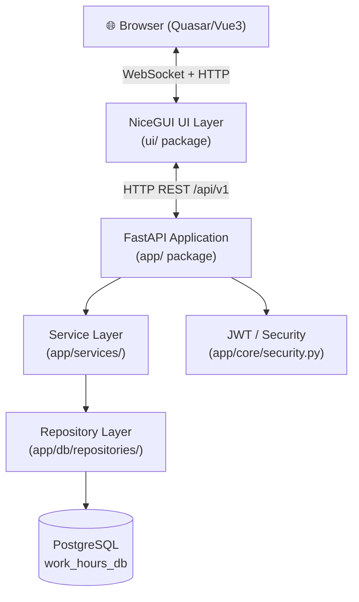
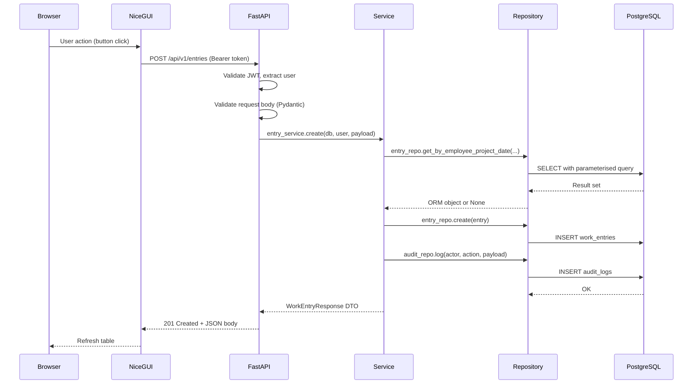
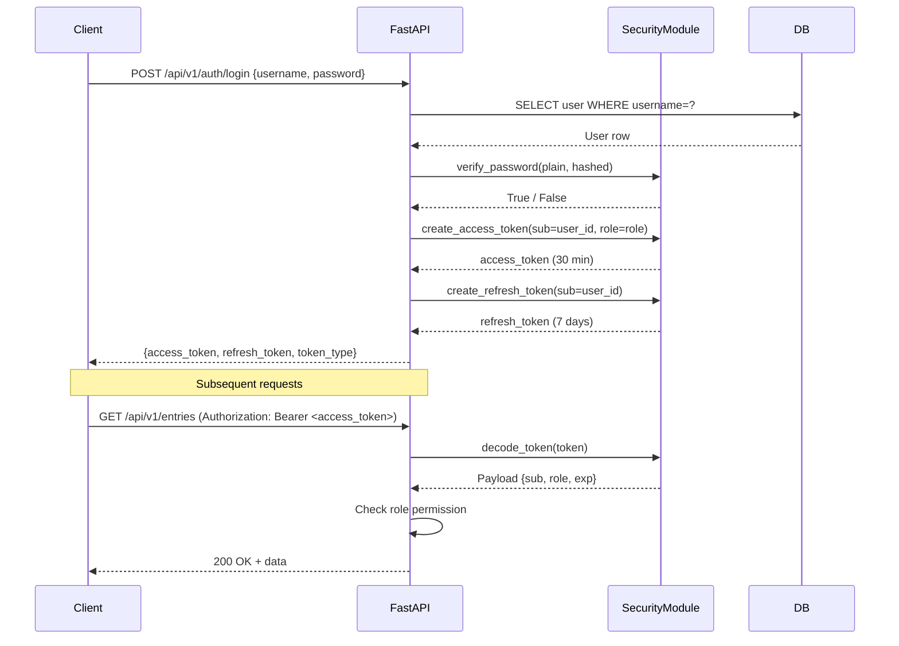
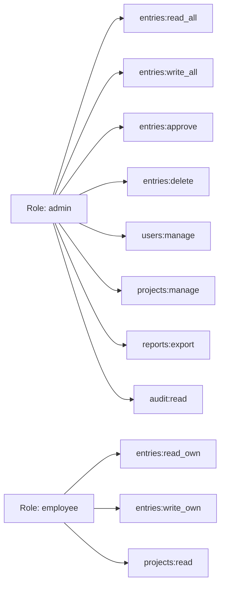
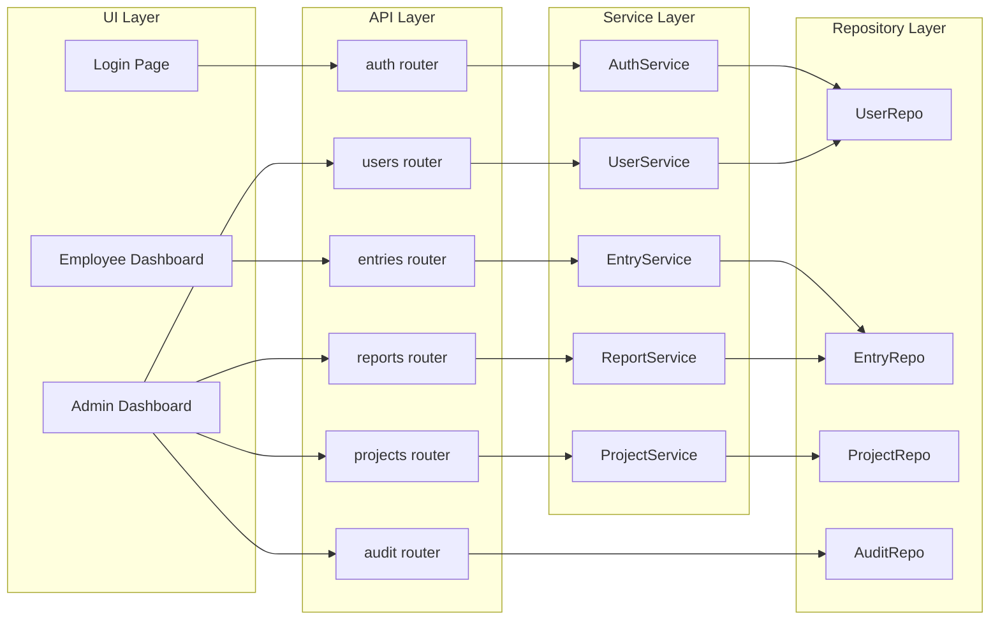
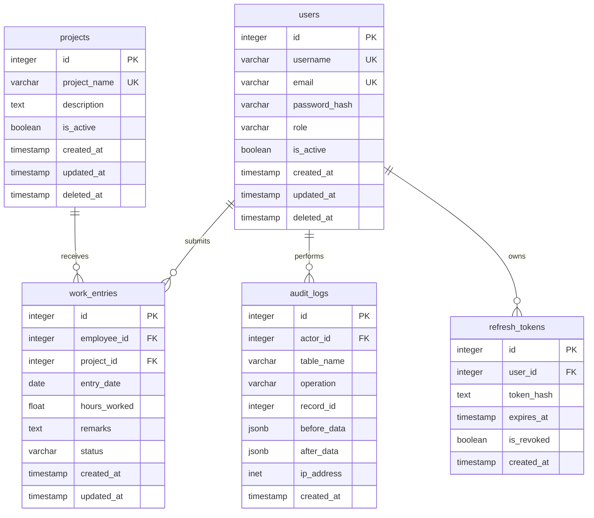

# WorkHours Enterprise — Architecture Documents
**Version:** 1.0.0 | **Date:** 2026-06-29 | **Author:** Nebula Tech IT / Mitanshu Joshi  
**Stack:** Python 3.13 · FastAPI · NiceGUI · SQLAlchemy 2.x · PostgreSQL · JWT · Alembic

---

# Document 1 — Product Requirement Document (PRD)

## 1.1 Objectives

| # | Objective |
|---|-----------|
| 1 | Provide employees a frictionless interface to log daily project-based work hours |
| 2 | Give admins full visibility, control, and reporting over all employee timesheets |
| 3 | Enforce RBAC so employees see only their own data and admins see everything |
| 4 | Maintain an immutable audit trail of all create/update/delete operations |
| 5 | Deliver a production-ready SaaS application following SOLID and Clean Architecture |

## 1.2 Scope

**In scope:**
- Employee login, timesheet submission, history view, profile management
- Admin dashboard: user management, project management, timesheet approval, reports, exports, audit logs, settings
- JWT-based authentication with refresh token rotation
- Role-Based Access Control (employee, admin)
- PostgreSQL persistence with Alembic migrations
- REST API (FastAPI) with full OpenAPI docs
- NiceGUI frontend consuming the FastAPI backend

**Out of scope (v1):**
- Kubernetes / Docker orchestration
- Multi-tenant SaaS billing
- Mobile native apps
- Third-party SSO (Google, SAML)

## 1.3 Assumptions

1. Single organisation deployment (one company, one database)
2. Admin accounts are created by a super-admin via CLI seed or directly in DB for v1
3. All times are stored in UTC; frontend displays in user's local timezone
4. PostgreSQL 14+ is available on the deployment server
5. Network is private (no public internet exposure required for v1)

## 1.4 Constraints

| Constraint | Detail |
|---|---|
| Language | Python 3.13+ only |
| ORM | SQLAlchemy 2.x (async-capable, sync used in v1) |
| UI framework | NiceGUI 2.x with Quasar components |
| Auth | JWT (access + refresh tokens); no session cookies |
| DB migrations | Alembic only; no raw DDL scripts |
| Password hashing | bcrypt (cost factor ≥ 12) |
| Validation | Pydantic v2 throughout |

## 1.5 Business Rules

| ID | Rule |
|----|------|
| BR-01 | An employee can submit at most one entry per project per calendar day |
| BR-02 | Hours worked must be > 0 and ≤ 24 |
| BR-03 | Employees can edit their **own** entries only on the same calendar day as submission, and only if status is `pending` |
| BR-04 | Once an admin approves an entry its status becomes `approved` and no further edits are allowed by the employee |
| BR-05 | Admins can edit or delete any entry regardless of status |
| BR-06 | Deleting a project soft-deletes it; existing work entries are preserved |
| BR-07 | Deleting a user soft-deletes it; their entries are preserved for historical reporting |
| BR-08 | All mutations (create/update/delete) write a corresponding row to `audit_logs` |
| BR-09 | Passwords must be ≥ 8 characters, contain at least one digit and one letter |
| BR-10 | JWT access tokens expire in 30 minutes; refresh tokens expire in 7 days |

## 1.6 Functional Requirements

### Employee
| ID | Requirement |
|----|-------------|
| FR-E01 | Employee can log in with username + password |
| FR-E02 | Employee sees a dashboard with a summary of this week's hours |
| FR-E03 | Employee can submit a work entry (date, project, hours, remarks) |
| FR-E04 | Employee can edit today's pending entry |
| FR-E05 | Employee can view full submission history with filters (date range, project) |
| FR-E06 | Employee can see approval status per entry |
| FR-E07 | Employee can change their own password |
| FR-E08 | Employee can view their profile (name, role) |

### Admin
| ID | Requirement |
|----|-------------|
| FR-A01 | Admin can view a dashboard with summary KPIs (total hours, active employees, pending approvals) |
| FR-A02 | Admin can list, search, and filter all work entries |
| FR-A03 | Admin can approve or reject individual entries |
| FR-A04 | Admin can edit or delete any entry |
| FR-A05 | Admin can create, rename, and soft-delete projects |
| FR-A06 | Admin can create, deactivate, and password-reset employee accounts |
| FR-A07 | Admin can export filtered entries to CSV |
| FR-A08 | Admin can view the full audit log |
| FR-A09 | Admin can view aggregate reports (hours per employee, per project, per date range) |

## 1.7 Acceptance Criteria

| ID | Criterion |
|----|-----------|
| AC-01 | Logging in with valid credentials redirects to the correct dashboard within 2s |
| AC-02 | Submitting a duplicate (same employee + project + date) returns HTTP 409 |
| AC-03 | Approving an entry changes its status to `approved` and blocks employee edits |
| AC-04 | CSV export downloads a file with correct headers and all filtered rows |
| AC-05 | Every create/update/delete operation produces an `audit_logs` row |
| AC-06 | An expired JWT returns HTTP 401 with `{"detail":"Token expired"}` |
| AC-07 | All Pydantic validation errors return HTTP 422 with field-level messages |

## 1.8 Risks

| Risk | Likelihood | Impact | Mitigation |
|------|-----------|--------|------------|
| PostgreSQL connection pool exhaustion | Low | High | Configure pool size; use connection pooler (PgBouncer) in production |
| Token theft via XSS | Medium | High | Store tokens in httpOnly cookies or secure memory; never localStorage |
| Bcrypt timing attacks on login | Low | Medium | Constant-time comparison already provided by passlib |
| Large exports blocking the event loop | Medium | Medium | Run CSV generation in a background thread / asyncio executor |

## 1.9 Future Enhancements

- Multi-tenant with schema-per-tenant isolation
- Email notifications (approval / rejection)
- Google / SAML SSO
- Slack integration for timesheet reminders
- PDF payroll report generation
- Mobile app (Flutter / React Native)

---

# Document 2 — Technical Requirement Document (TRD)

## 2.1 Technology Stack

| Layer | Technology | Version | Justification |
|-------|-----------|---------|---------------|
| Language | Python | 3.13+ | Latest stable; pattern matching, improved performance |
| Web framework | FastAPI | 0.115+ | Async-first, auto OpenAPI, Pydantic v2 native |
| UI framework | NiceGUI | 2.x | Python-first SPA on top of Quasar/Vue3 |
| ORM | SQLAlchemy | 2.x | Mature, type-annotated, session-per-request |
| Migrations | Alembic | 1.x | Industry standard for SQLAlchemy projects |
| Database | PostgreSQL | 14+ | ACID, JSON support, excellent indexing |
| Auth | python-jose + passlib | latest | JWT signing (HS256), bcrypt hashing |
| Validation | Pydantic | v2 | Fast, strict, integrates with FastAPI |
| Testing | pytest + httpx | latest | Async-compatible API testing |
| Linting | Ruff + Black + isort | latest | Speed + consistency |
| Type checking | MyPy | latest | Strict mode on all modules |

## 2.2 Engineering Principles

| Principle | Application |
|-----------|-------------|
| SOLID | Each module has one reason to change; interfaces preferred over concrete types |
| Clean Architecture | UI → API → Service → Repository → DB; each layer only depends inward |
| Repository Pattern | All DB queries live in `repositories/`; services never call SQLAlchemy directly |
| Service Layer | Business logic lives in `services/`; repositories are called only from services |
| Dependency Injection | FastAPI `Depends()` for DB session, current user, permissions |
| DRY | Shared Pydantic base models; shared repository base class |
| Twelve-Factor | Config from env vars; stateless app; explicit dependencies in `requirements.txt` |

## 2.3 Non-Functional Requirements

| NFR | Target |
|-----|--------|
| Response time (P95) | < 500 ms for all API endpoints under 100 concurrent users |
| Availability | 99.5% uptime (single-server v1) |
| Password hashing | bcrypt cost factor 12 (≈ 250 ms per hash) |
| Token expiry | Access: 30 min, Refresh: 7 days |
| DB connection pool | min=5, max=20 |
| Pagination | Default page size 20, max 100 |
| Audit log retention | Minimum 12 months |

## 2.4 Folder Structure (Production)

```
workhours/
├── app/
│   ├── api/
│   │   └── v1/
│   │       ├── endpoints/
│   │       │   ├── auth.py          # login, refresh, logout
│   │       │   ├── users.py         # CRUD for admin
│   │       │   ├── projects.py      # CRUD
│   │       │   ├── entries.py       # work entries
│   │       │   ├── reports.py       # aggregate reports + export
│   │       │   └── audit.py         # audit log read
│   │       └── router.py            # aggregates all endpoint routers
│   ├── core/
│   │   ├── config.py                # Settings (pydantic-settings)
│   │   ├── security.py              # JWT create/verify, password hash
│   │   ├── deps.py                  # Shared FastAPI dependencies
│   │   └── exceptions.py            # Custom HTTPException subclasses
│   ├── db/
│   │   ├── base.py                  # DeclarativeBase, metadata
│   │   ├── session.py               # engine, SessionLocal, get_db
│   │   └── repositories/
│   │       ├── base.py              # BaseRepository[T]
│   │       ├── user_repo.py
│   │       ├── project_repo.py
│   │       ├── entry_repo.py
│   │       └── audit_repo.py
│   ├── models/                      # SQLAlchemy ORM models
│   │   ├── user.py
│   │   ├── project.py
│   │   ├── work_entry.py
│   │   └── audit_log.py
│   ├── schemas/                     # Pydantic v2 schemas (request/response DTOs)
│   │   ├── auth.py
│   │   ├── user.py
│   │   ├── project.py
│   │   ├── entry.py
│   │   └── audit.py
│   ├── services/                    # Business logic
│   │   ├── auth_service.py
│   │   ├── user_service.py
│   │   ├── project_service.py
│   │   ├── entry_service.py
│   │   └── report_service.py
│   ├── utils/
│   │   ├── pagination.py
│   │   └── csv_export.py
│   └── main.py                      # FastAPI app factory + lifespan
├── ui/                              # NiceGUI frontend
│   ├── pages/
│   │   ├── login.py
│   │   ├── employee_dashboard.py
│   │   └── admin_dashboard.py
│   ├── components/
│   │   ├── nav_bar.py
│   │   ├── data_table.py
│   │   └── dialogs.py
│   ├── theme.py                     # Design tokens
│   └── main.py                      # ui.run() entry point
├── alembic/
│   ├── env.py
│   ├── script.py.mako
│   └── versions/
├── tests/
│   ├── unit/
│   └── integration/
├── .env.example
├── alembic.ini
├── requirements.txt
└── README.md
```

## 2.5 Security Requirements

| Control | Implementation |
|---------|---------------|
| Authentication | JWT Bearer tokens (HS256), httpOnly cookie option |
| Authorisation | RBAC via `Depends(require_role("admin"))` |
| Password storage | bcrypt, cost 12 |
| Input validation | Pydantic v2 strict mode |
| SQL injection | SQLAlchemy parameterised queries (no raw SQL) |
| CORS | Restricted to known origins via `CORSMiddleware` |
| Rate limiting | `slowapi` on `/auth/login` (10 req/min per IP) |
| Error responses | No stack traces in production; generic messages |
| Secrets | Loaded from environment variables; never hardcoded |
| Audit trail | All mutations logged with actor, timestamp, before/after payload |

---

# Document 3 — System Architecture

## 3.1 Architecture Overview

The system follows a **Modular Monolith** with **Clean Architecture** layering. All layers run in a single Python process; the boundary between NiceGUI (UI layer) and FastAPI (API layer) is a localhost HTTP call, allowing clean separation and future service extraction.



## 3.2 Request Lifecycle



## 3.3 Authentication Flow



## 3.4 RBAC Model



## 3.5 Component Interaction



---

# Document 4 — PostgreSQL Database Design

## 4.1 Entity Relationship Diagram



## 4.2 Table Definitions

### 4.2.1 `users`

| Column | Type | Nullable | Default | Notes |
|--------|------|----------|---------|-------|
| id | SERIAL | NO | auto | PK |
| username | VARCHAR(100) | NO | — | Unique, indexed |
| email | VARCHAR(255) | YES | NULL | Unique when provided |
| password_hash | VARCHAR(255) | NO | — | bcrypt, cost 12 |
| role | VARCHAR(20) | NO | `employee` | Enum: `admin`, `employee` |
| is_active | BOOLEAN | NO | `true` | Soft-delete flag |
| created_at | TIMESTAMPTZ | NO | `now()` | Audit timestamp |
| updated_at | TIMESTAMPTZ | NO | `now()` | Auto-updated via trigger |
| deleted_at | TIMESTAMPTZ | YES | NULL | Non-null = soft deleted |

**Indexes:** `idx_users_username`, `idx_users_email`, `idx_users_is_active`

**Business rules enforced:** Partial unique index on `username WHERE deleted_at IS NULL`

---

### 4.2.2 `projects`

| Column | Type | Nullable | Default | Notes |
|--------|------|----------|---------|-------|
| id | SERIAL | NO | auto | PK |
| project_name | VARCHAR(200) | NO | — | Unique among active |
| description | TEXT | YES | NULL | — |
| is_active | BOOLEAN | NO | `true` | Soft-delete flag |
| created_at | TIMESTAMPTZ | NO | `now()` | — |
| updated_at | TIMESTAMPTZ | NO | `now()` | — |
| deleted_at | TIMESTAMPTZ | YES | NULL | — |

**Indexes:** `idx_projects_name`, `idx_projects_is_active`

---

### 4.2.3 `work_entries`

| Column | Type | Nullable | Default | Notes |
|--------|------|----------|---------|-------|
| id | SERIAL | NO | auto | PK |
| employee_id | INTEGER | NO | — | FK → users.id |
| project_id | INTEGER | NO | — | FK → projects.id |
| entry_date | DATE | NO | — | Calendar date of work |
| hours_worked | NUMERIC(5,2) | NO | — | > 0 and ≤ 24; NUMERIC preferred over FLOAT |
| remarks | TEXT | YES | NULL | Optional notes |
| status | VARCHAR(20) | NO | `pending` | Enum: `pending`, `approved`, `rejected` |
| created_at | TIMESTAMPTZ | NO | `now()` | — |
| updated_at | TIMESTAMPTZ | NO | `now()` | — |

**Constraints:**
- `chk_hours_range`: `hours_worked > 0 AND hours_worked <= 24`
- `uq_employee_project_date`: UNIQUE(employee_id, project_id, entry_date) — prevents BR-01 duplicate

**Indexes:** `idx_entries_employee_date`, `idx_entries_project`, `idx_entries_status`, `idx_entries_date`

---

### 4.2.4 `audit_logs`

| Column | Type | Nullable | Default | Notes |
|--------|------|----------|---------|-------|
| id | SERIAL | NO | auto | PK |
| actor_id | INTEGER | YES | NULL | FK → users.id (NULL if system action) |
| table_name | VARCHAR(100) | NO | — | e.g. `work_entries` |
| operation | VARCHAR(20) | NO | — | Enum: `INSERT`, `UPDATE`, `DELETE` |
| record_id | INTEGER | NO | — | PK of the mutated row |
| before_data | JSONB | YES | NULL | Row state before mutation |
| after_data | JSONB | YES | NULL | Row state after mutation |
| ip_address | INET | YES | NULL | Client IP |
| created_at | TIMESTAMPTZ | NO | `now()` | — |

**Indexes:** `idx_audit_actor`, `idx_audit_table_record`, `idx_audit_created_at`

---

### 4.2.5 `refresh_tokens`

| Column | Type | Nullable | Default | Notes |
|--------|------|----------|---------|-------|
| id | SERIAL | NO | auto | PK |
| user_id | INTEGER | NO | — | FK → users.id |
| token_hash | TEXT | NO | — | SHA-256 of the raw token |
| expires_at | TIMESTAMPTZ | NO | — | 7 days from creation |
| is_revoked | BOOLEAN | NO | `false` | Set to true on logout |
| created_at | TIMESTAMPTZ | NO | `now()` | — |

**Indexes:** `idx_rtoken_user`, `idx_rtoken_hash`

---

## 4.3 Normalization

The schema is in **3NF**:
- Every non-key attribute depends on the whole key only
- No transitive dependencies
- Junction data (`hours_worked`, `remarks`, `status`) belongs to the composite natural key of `work_entries`

## 4.4 Alembic Migration Strategy

```
alembic/versions/
  0001_create_users_table.py
  0002_create_projects_table.py
  0003_create_work_entries_table.py
  0004_create_audit_logs_table.py
  0005_create_refresh_tokens_table.py
  0006_add_soft_delete_to_users_projects.py
  0007_seed_initial_data.py
```

Run migrations: `alembic upgrade head`  
Roll back one step: `alembic downgrade -1`

## 4.5 Sample Seed Data

| Table | Seed records |
|-------|-------------|
| users | 1 admin + 5 employees |
| projects | Website Redesign, Mobile App, Data Migration, API Integration, Security Audit |
| work_entries | 10 sample entries spread across last 7 days |

---

# Document 5 — REST API Design

## 5.1 Design Principles

- Base path: `/api/v1`
- All bodies: `application/json`
- Auth: `Authorization: Bearer <access_token>`
- Error format: `{"detail": "message"}` or `{"detail": [{"loc": [...], "msg": "..."}]}`
- Pagination: query params `page=1&size=20`; response wraps in `{"items": [...], "total": N, "page": N, "size": N}`
- Timestamps: ISO 8601 UTC (`2026-06-29T10:30:00Z`)

---

## 5.2 Auth Endpoints

### POST `/api/v1/auth/login`

**Purpose:** Authenticate user, receive tokens  
**Auth:** None

**Request:**
```json
{
  "username": "mitanshu",
  "password": "SecurePass1"
}
```

**Response 200:**
```json
{
  "access_token": "eyJhbG...",
  "refresh_token": "eyJhbG...",
  "token_type": "bearer",
  "role": "employee"
}
```

**Error responses:**

| Code | Body | Condition |
|------|------|-----------|
| 401 | `{"detail":"Invalid credentials"}` | Wrong username or password |
| 422 | Pydantic error array | Missing or malformed fields |
| 429 | `{"detail":"Too many requests"}` | Rate limit exceeded |

---

### POST `/api/v1/auth/refresh`

**Purpose:** Exchange refresh token for new access token  
**Auth:** None (refresh token in body)

**Request:**
```json
{ "refresh_token": "eyJhbG..." }
```

**Response 200:**
```json
{
  "access_token": "eyJhbG...",
  "token_type": "bearer"
}
```

| Code | Condition |
|------|-----------|
| 401 | Token expired or revoked |

---

### POST `/api/v1/auth/logout`

**Purpose:** Revoke refresh token  
**Auth:** Bearer

**Request:**
```json
{ "refresh_token": "eyJhbG..." }
```

**Response 200:**
```json
{ "message": "Logged out successfully" }
```

---

### POST `/api/v1/auth/change-password`

**Purpose:** Employee or admin changes own password  
**Auth:** Bearer

**Request:**
```json
{
  "current_password": "OldPass1",
  "new_password": "NewPass2"
}
```

**Response 200:**
```json
{ "message": "Password changed successfully" }
```

| Code | Condition |
|------|-----------|
| 400 | Current password incorrect |
| 422 | New password fails complexity rules |

---

## 5.3 Users Endpoints (Admin only)

### GET `/api/v1/users`

**Auth:** Bearer (admin)  
**Query params:** `page`, `size`, `search` (username/email), `role`, `is_active`

**Response 200:**
```json
{
  "items": [
    {
      "id": 1,
      "username": "mitanshu",
      "email": "mitanshu@company.com",
      "role": "employee",
      "is_active": true,
      "created_at": "2026-06-01T09:00:00Z"
    }
  ],
  "total": 6,
  "page": 1,
  "size": 20
}
```

---

### POST `/api/v1/users`

**Auth:** Bearer (admin)

**Request:**
```json
{
  "username": "newuser",
  "email": "newuser@company.com",
  "password": "TempPass1",
  "role": "employee"
}
```

**Response 201:**
```json
{
  "id": 7,
  "username": "newuser",
  "email": "newuser@company.com",
  "role": "employee",
  "is_active": true,
  "created_at": "2026-06-29T10:00:00Z"
}
```

| Code | Condition |
|------|-----------|
| 409 | Username or email already exists |
| 422 | Validation failure |

---

### PATCH `/api/v1/users/{user_id}`

**Auth:** Bearer (admin)  
**Purpose:** Update role or active status

**Request:**
```json
{ "is_active": false }
```

**Response 200:** Updated user object

---

### DELETE `/api/v1/users/{user_id}`

**Auth:** Bearer (admin)  
**Effect:** Soft delete (sets `deleted_at`, `is_active=false`)

**Response 200:**
```json
{ "message": "User deactivated" }
```

| Code | Condition |
|------|-----------|
| 404 | User not found |
| 400 | Cannot deactivate yourself |

---

## 5.4 Projects Endpoints

### GET `/api/v1/projects`

**Auth:** Bearer (any role)  
**Query params:** `page`, `size`, `search`, `is_active`

**Response 200:**
```json
{
  "items": [
    { "id": 1, "project_name": "Website Redesign", "description": null, "is_active": true }
  ],
  "total": 5,
  "page": 1,
  "size": 20
}
```

---

### POST `/api/v1/projects`

**Auth:** Bearer (admin)

**Request:**
```json
{ "project_name": "Cloud Migration", "description": "Move infra to AWS" }
```

**Response 201:** Project object

| Code | Condition |
|------|-----------|
| 409 | Project name already exists |

---

### PATCH `/api/v1/projects/{project_id}`

**Auth:** Bearer (admin)

**Request:**
```json
{ "project_name": "Cloud Migration v2", "description": "Updated scope" }
```

**Response 200:** Updated project object

---

### DELETE `/api/v1/projects/{project_id}`

**Auth:** Bearer (admin)  
**Effect:** Soft delete

**Response 200:**
```json
{ "message": "Project deactivated" }
```

---

## 5.5 Work Entries Endpoints

### GET `/api/v1/entries`

**Auth:** Bearer  
- Admin: returns all entries  
- Employee: returns own entries only

**Query params:** `page`, `size`, `employee_id` (admin only), `project_id`, `date_from` (YYYY-MM-DD), `date_to`, `status`, `search`

**Response 200:**
```json
{
  "items": [
    {
      "id": 42,
      "employee_id": 3,
      "employee_username": "mitanshu",
      "project_id": 1,
      "project_name": "Website Redesign",
      "entry_date": "2026-06-28",
      "hours_worked": 7.5,
      "remarks": "Worked on auth module",
      "status": "pending",
      "created_at": "2026-06-28T18:30:00Z",
      "updated_at": "2026-06-28T18:30:00Z"
    }
  ],
  "total": 1,
  "page": 1,
  "size": 20
}
```

---

### POST `/api/v1/entries`

**Auth:** Bearer (any role, records as current user)

**Request:**
```json
{
  "project_id": 1,
  "entry_date": "2026-06-29",
  "hours_worked": 8.0,
  "remarks": "Completed feature X"
}
```

**Response 201:** Entry object

| Code | Condition |
|------|-----------|
| 409 | Duplicate employee + project + date |
| 422 | Hours out of range; date missing |

---

### PATCH `/api/v1/entries/{entry_id}`

**Auth:** Bearer  
- Employee: only own entry, only if `status=pending` and `entry_date=today`  
- Admin: any entry, any status

**Request:**
```json
{
  "hours_worked": 6.5,
  "remarks": "Revised after meeting"
}
```

**Response 200:** Updated entry object

| Code | Condition |
|------|-----------|
| 403 | Employee tries to edit approved/old entry |
| 404 | Entry not found |

---

### DELETE `/api/v1/entries/{entry_id}`

**Auth:** Bearer (admin only)

**Response 200:**
```json
{ "message": "Entry deleted" }
```

---

### POST `/api/v1/entries/{entry_id}/approve`

**Auth:** Bearer (admin only)

**Request:** Empty body

**Response 200:**
```json
{ "id": 42, "status": "approved", "updated_at": "2026-06-29T11:00:00Z" }
```

---

### POST `/api/v1/entries/{entry_id}/reject`

**Auth:** Bearer (admin only)

**Request:**
```json
{ "reason": "Missing project details" }
```

**Response 200:**
```json
{ "id": 42, "status": "rejected", "updated_at": "2026-06-29T11:00:00Z" }
```

---

## 5.6 Reports Endpoints

### GET `/api/v1/reports/summary`

**Auth:** Bearer (admin)  
**Query params:** `date_from`, `date_to`, `employee_id`, `project_id`

**Response 200:**
```json
{
  "total_hours": 342.5,
  "total_entries": 48,
  "by_employee": [
    { "employee_username": "mitanshu", "total_hours": 72.0 }
  ],
  "by_project": [
    { "project_name": "Website Redesign", "total_hours": 120.0 }
  ]
}
```

---

### GET `/api/v1/reports/export`

**Auth:** Bearer (admin)  
**Query params:** Same as `/entries` filters  
**Response:** `text/csv` download

```
id,employee,project,date,hours,remarks,status
42,mitanshu,Website Redesign,2026-06-28,7.5,Worked on auth module,pending
```

---

## 5.7 Audit Endpoints

### GET `/api/v1/audit`

**Auth:** Bearer (admin)  
**Query params:** `page`, `size`, `table_name`, `operation`, `actor_id`, `date_from`, `date_to`

**Response 200:**
```json
{
  "items": [
    {
      "id": 1,
      "actor_username": "admin",
      "table_name": "work_entries",
      "operation": "UPDATE",
      "record_id": 42,
      "before_data": { "hours_worked": 7.5 },
      "after_data": { "hours_worked": 6.5 },
      "ip_address": "192.168.1.10",
      "created_at": "2026-06-29T11:00:00Z"
    }
  ],
  "total": 1,
  "page": 1,
  "size": 20
}
```

---

## 5.8 HTTP Status Code Reference

| Code | Meaning |
|------|---------|
| 200 | OK — successful GET, PATCH, DELETE |
| 201 | Created — successful POST |
| 400 | Bad Request — business rule violation |
| 401 | Unauthorised — missing or invalid token |
| 403 | Forbidden — authenticated but insufficient role |
| 404 | Not Found — resource does not exist |
| 409 | Conflict — duplicate resource |
| 422 | Unprocessable Entity — Pydantic validation error |
| 429 | Too Many Requests — rate limit exceeded |
| 500 | Internal Server Error — unexpected failure |

---

*End of Phase 1 Architecture Documents — PRD, TRD, System Architecture, DB Design, API Design*  
*Next documents: Frontend Architecture, UI/UX Design System, Security Design, Testing Strategy, Implementation Roadmap, Legal & Compliance documents.*
