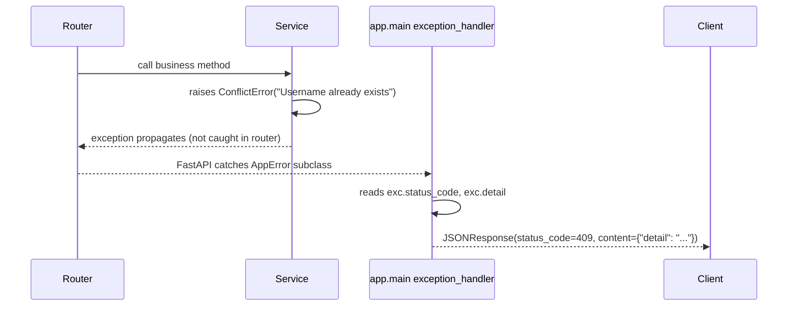
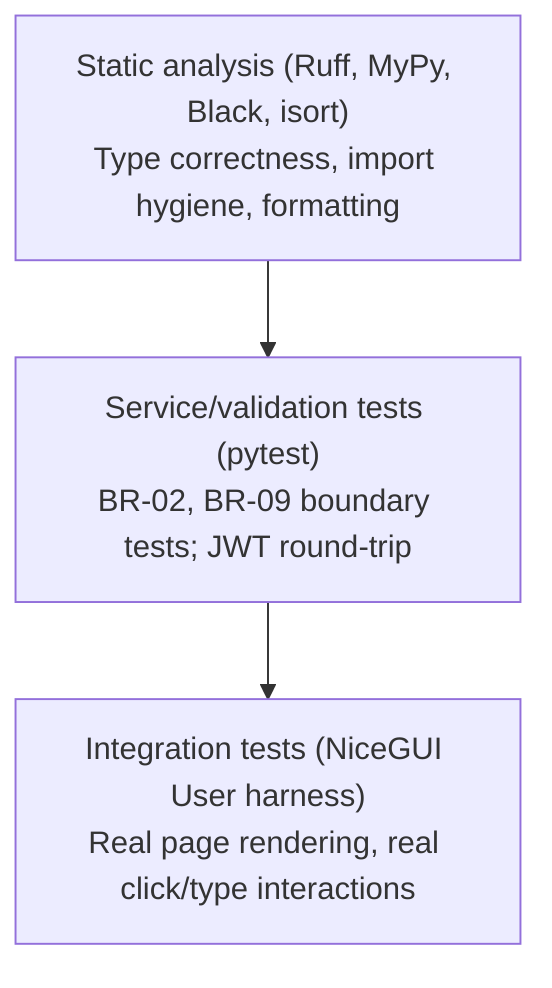
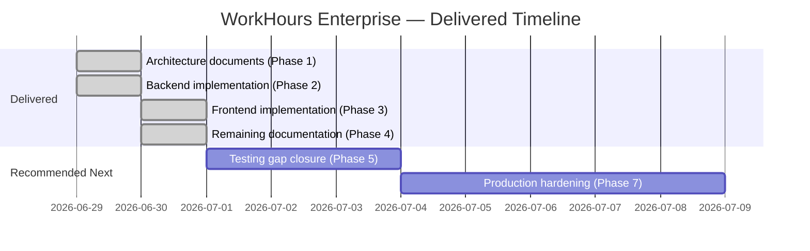

# WorkHours Enterprise — Technical Documents (Part 2)
**Version:** 1.0.0 | **Date:** 2026-06-30 | **Author:** Nebula Tech IT / Mitanshu Joshi
**Companion to:** `architecture-documents.md` (PRD, TRD, System Architecture, DB Design, API Design)

---

# Document 6 — Frontend Architecture

## 6.1 Objectives

| # | Objective |
|---|-----------|
| 1 | Provide a Python-only frontend (no separate JS build step) consuming the FastAPI backend over REST |
| 2 | Keep UI state in server-side session storage, never in browser localStorage |
| 3 | Enforce the same RBAC boundary visually that the backend enforces at the API layer |
| 4 | Reuse a small set of components across both dashboards rather than duplicating markup |

## 6.2 Scope

In scope: page-level layout, component library, theming, client-side validation mirroring backend rules, state management strategy, API integration pattern.
Out of scope: server-side rendering/SEO concerns (this is an authenticated internal tool, not a public site); offline support; native mobile wrapper.

## 6.3 Folder Structure

```
ui/
├── pages/
│   ├── login.py                # FR-E01 — credential entry, JWT acquisition
│   ├── employee_dashboard.py   # FR-E02–E08 — submit/edit/history
│   └── admin_dashboard.py      # FR-A01–A09 — tabs: entries/users/projects/reports/audit
├── components/
│   ├── nav_bar.py              # Shared header: brand, username, role badge, logout
│   ├── status_badge.py         # Pending/approved/rejected pill, color-coded
│   ├── dialogs.py               # confirm_dialog() for destructive actions
│   ├── date_picker.py           # Quasar q-date popup, blocks future dates
│   ├── hours_input.py           # Combined dropdown + free-text hours field
│   └── data_table.py            # ui.table wrapper with consistent pagination/styling
├── theme.py                     # Design tokens: brand colors, status colors, global CSS
├── api_client.py                # httpx wrapper: JWT storage, auth headers, refresh-on-401
└── main.py                      # Route registration (@ui.page) + ui.run() entry point
```

## 6.4 Routing

| Route | Page | Auth Guard |
|-------|------|-----------|
| `/` | Redirect dispatcher | Checks `is_logged_in()` and `current_role()`, sends to `/login`, `/dashboard`, or `/admin` |
| `/login` | Login form | None (must be unauthenticated to reach the form meaningfully) |
| `/dashboard` | Employee dashboard | `is_logged_in()` — redirects to `/login` if false |
| `/admin` | Admin dashboard | `is_logged_in()` AND `current_role() == "admin"` — redirects to `/dashboard` if employee |

Route guards run inside each page function body (not Python-level middleware), since NiceGUI pages execute per-client-connection; this is the equivalent of an SPA route guard in this framework.

## 6.5 Layouts

Both dashboards share a single layout pattern: a fixed `ui.header()` (the nav bar) followed by a centered, max-width `ui.column()` containing the page content. This avoids layout duplication while letting each page's content area scale independently (max-width `4xl` for the employee dashboard's narrower single-column form, `6xl` for the admin dashboard's wider tabbed tables).

## 6.6 Components

| Component | Reused by | Responsibility |
|-----------|-----------|-----------------|
| `render_nav_bar()` | Both dashboards | Brand, username, role badge, logout button |
| `render_status_badge()` | Employee history, admin entries, admin audit | Color-coded pill for `pending`/`approved`/`rejected` |
| `confirm_dialog()` | Admin entries (delete), admin projects (deactivate) | Two-step destructive-action confirmation |
| `render_date_picker()` | Employee submit form | Quasar `q-date` popup; blocks dates after `max_date` (default: today) |
| `render_hours_input()` / `parse_hours_value()` | Employee submit form, employee edit dialog | Dropdown of common values + free-text entry; client-side BR-02 validation before submit |
| `render_data_table()` | Available for any future tabular view | Thin `ui.table` wrapper with consistent flat/bordered styling and pagination defaults |

## 6.7 Reusable Widgets — Forms, Tables, Dialogs

- **Forms:** built from native NiceGUI inputs (`ui.input`, `ui.select`, `ui.textarea`) with `outlined dense` Quasar props applied uniformly via direct `.props()` calls rather than a custom form wrapper, since NiceGUI's own input components already provide validation hooks.
- **Tables:** the admin dashboard's entries/users/projects/audit lists are rendered as repeated `ui.row()` cards rather than `ui.table` grids, by design — each row needs inline action buttons (approve/reject/delete/toggle) that are awkward to embed in a strict tabular grid. `data_table.py` remains available for any future purely-tabular, read-only view (e.g. a future raw export preview).
- **Dialogs:** `ui.dialog()` + `ui.card()` is the pattern for every modal (create user, create project, edit entry, reject reason, confirm delete) — consistent `wh-card` styling, consistent Cancel/Confirm button placement (left-flat, right-filled).

## 6.8 Theme

Single source of truth: `ui/theme.py`. Carries forward the existing brand palette from the original `project-work-hours` codebase rather than introducing a new one:

| Token | Value | Usage |
|-------|-------|-------|
| `BRAND_BLUE` | `#1E3A5F` | Header background, page titles |
| `ACCENT` | `#2563EB` | Primary buttons, links |
| `DANGER` | `#DC2626` | Destructive actions, error text, rejected status |
| `SUCCESS` | `#16A34A` | Confirmations, approved status |
| `WARNING` | `#D97706` | Pending status, KPI warning card |

`apply_global_theme()` sets Quasar's `ui.colors()` (primary/negative/positive) and injects a small global `<style>` block (`.wh-card` for consistent card radius/border/shadow) — called once per page render.

## 6.9 Responsive Design

NiceGUI's underlying Quasar grid is responsive by default; the project does not hand-roll custom breakpoints. Specific decisions:
- Login card: `max-width: 380px`, full width below that, centered vertically and horizontally — works correctly down to narrow mobile viewports without modification.
- Employee dashboard: single-column `max-width: 4xl` — naturally responsive since there's no multi-column layout to break.
- Admin dashboard: `max-width: 6xl` with tabs; the KPI row uses `ui.row().classes("gap-4")` with `flex-1` cards, which wrap acceptably on narrow screens since Quasar's flex row wraps by default once content can't fit at minimum width.

## 6.10 Accessibility

- All form inputs carry visible `label` props (Quasar renders these as floating labels, not placeholder-only text) — meets WCAG 2.2's requirement that label text remain visible during input, not just before.
- Color is never the only signal for status: `render_status_badge()` pairs color with the capitalized status word itself.
- Icon-only buttons (approve/reject/delete in the admin table) use Quasar's `flat dense round` style with the icon name itself (`check`, `close`, `delete`, `edit`) — a future iteration should add explicit `aria-label` props via `.props('aria-label="Approve entry"')` for screen-reader users; this is flagged in §13 Future Enhancements rather than implemented in v1, since NiceGUI/Quasar icon buttons default to icon-only without forcing an unlabeled state, and the v1 priority was functional completeness.

## 6.11 Validation Strategy

Client-side validation is a **convenience layer only** — every rule it checks is re-validated server-side (Pydantic schemas + service-layer business rules), so a bypassed or buggy client check can never produce an invalid database state. Specifically: `parse_hours_value()` mirrors BR-02 (0 < hours ≤ 24) before the API call to give immediate feedback rather than waiting for a 422 response; the date picker's `:options` prop mirrors the "no future dates" rule for the same reason. Server-side messages (e.g. 409 duplicate-entry) are surfaced verbatim in error labels rather than re-interpreted, so the two layers never give contradictory feedback.

## 6.12 Loading / Empty / Success / Error States

| State | Pattern used |
|-------|-------------|
| Loading | Each panel's `refresh()` function clears its container first, then repopulates synchronously — given the small seeded dataset sizes and localhost-class latency this is acceptable without a dedicated spinner; a spinner is listed in §13 Future Enhancements for production-scale data volumes. |
| Empty | Explicit muted-gray message per list ("No entries yet — submit your first one above.", "No entries match this filter.", "No audit events yet.") rather than a blank container. |
| Success | `ui.notify(..., type="positive")` toast on every successful mutation (submit, approve, create user, etc.). |
| Error | `ApiError.detail` surfaced either as an inline label (forms) or `ui.notify(..., type="negative")` toast (list actions) — always the server's actual message, never a generic "something went wrong". |

## 6.13 API Integration

All API calls flow through `ui/api_client.py`, never directly via `httpx` from page code. This wrapper:
1. Reads the JWT from `app.storage.user` (NiceGUI's secure, server-side, per-browser-tab session storage — explicitly not `localStorage`, since tokens must not be readable by arbitrary client-side JS)
2. Attaches `Authorization: Bearer <token>` to every outgoing request
3. On a 401 response, attempts exactly one silent refresh via `/auth/refresh` and retries the original request once
4. Raises `ApiError(status_code, detail)` on any remaining 4xx/5xx, which every page catches and turns into a user-facing message

## 6.14 State Management Strategy

No global frontend state store (no Redux/Zustand equivalent) — by design. Each page function is re-executed fresh per browser connection (NiceGUI's per-client execution model), so:
- **Session-level state** (JWT tokens, role, username) lives in `app.storage.user`, the only state that needs to outlive a single page load.
- **Page-level state** (form field values, the currently-loaded entries list) lives as local Python closures inside each page function — captured naturally by the nested `refresh()`/`do_submit()` functions without needing an explicit state object.

This keeps the mental model simple: there is exactly one place session state lives, and everything else is ordinary Python scope.

---

# Document 7 — UI/UX Design System

## 7.1 Objectives

Provide a small, consistent visual language reusable across every screen, carried forward from (not replacing) the existing `project-work-hours` brand identity.

## 7.2 Color Palette

| Token | Hex | Role |
|-------|-----|------|
| Brand Blue | `#1E3A5F` | Primary brand, headers, titles |
| Accent | `#2563EB` | Interactive elements (buttons, primary actions) |
| Danger | `#DC2626` | Errors, destructive actions, rejected status |
| Success | `#16A34A` | Confirmations, approved status |
| Warning | `#D97706` | Pending status, attention-needed KPIs |
| Muted text | `#64748B` | Secondary text, helper copy |
| Border | `#E2E8F0` | Card borders, row dividers |
| Surface | `#F8FAFC` | Page background |

## 7.3 Typography

NiceGUI/Quasar's default font stack is used without override, keeping cross-platform rendering predictable. Hierarchy is expressed through size and weight rather than custom font families:

| Use | Size | Weight |
|-----|------|--------|
| Page title | 1.3rem | 800 |
| Card section header | 1.05rem | 700 |
| Body / row primary text | 1rem (default) | 600 |
| Secondary / helper text | 0.85rem | 400 |
| Badge / pill text | 0.78rem | 700 |

## 7.4 Spacing

Card internal padding is consistently `16px`–`20px`; vertical gaps between page sections are `16px`–`24px`; row dividers inside list panels use a `1px solid #E2E8F0` bottom border with `10px` vertical padding, giving a dense-but-readable list rhythm appropriate for a timesheet tool where admins may scan many rows at once.

## 7.5 Components Library

The single shared `.wh-card` CSS class (12px border radius, light border, subtle shadow) is the visual anchor every card-like surface uses — form cards, KPI cards, dialog cards, list panels — so the whole application reads as one coherent system rather than a patchwork of differently-styled containers.

## 7.6 Iconography

Material icon names (consumed directly via Quasar's `icon` prop, no separate icon font/library needed): `edit_calendar` (date picker trigger), `edit` (employee entry edit), `check`/`close` (admin approve/reject), `delete` (admin delete actions), `refresh` (manual list reload).

## 7.7 States & Feedback

Status pills (`render_status_badge`) use a tinted-background + colored-text pattern (10% opacity background tint of the status color, full-opacity text) rather than solid-fill badges, keeping them legible without visually overpowering the row they sit in.

---

# Document 8 — Screen Specifications

## 8.1 Login Screen

**Route:** `/login`
**Layout:** Centered card, max-width 380px.
**Fields:** Username (text), Password (password, with visibility toggle).
**Actions:** Sign In (primary, full-width). Enter key on the password field triggers the same action as clicking Sign In.
**States:** Empty-field validation ("Please enter both username and password."), invalid-credential error ("Invalid username or password." — deliberately generic, not "username not found" vs "wrong password", to avoid leaking which usernames exist), generic failure fallback (surfaces the server's actual error detail).
**Post-login behaviour:** Stores access/refresh tokens and role in session storage, fetches `/profile/me` to confirm the canonical username, then navigates to `/admin` (role=admin) or `/dashboard` (role=employee).

## 8.2 Employee Dashboard

**Route:** `/dashboard`
**Sections (top to bottom):**
1. **Submit Work Hours card** — Project select (populated from `/projects?is_active=true`), date picker (defaults to today, blocks future dates), hours input (dropdown of common values + free text), optional remarks textarea, Submit button.
2. **Submission History card** — List of the employee's own entries (newest first), each row showing project + date + hours + remarks + status badge; an edit icon appears only on rows where `status == "pending"` AND `entry_date == today` (mirroring BR-03/BR-04).

**Edit dialog** (opened from a history row): hours input pre-filled with the current value, remarks textarea pre-filled, Save/Cancel.

## 8.3 Admin Dashboard

**Route:** `/admin`
**Top section:** Three KPI cards — Total Hours Logged, Total Entries, Pending Approvals (all admin-scoped, i.e. across every employee).
**Tabs:**

| Tab | Content |
|-----|---------|
| Entries | Status filter dropdown, manual refresh button, Export CSV button; each row shows employee + project + date + hours + remarks + status, with approve/reject icons (pending only) and a delete icon (always, admin-only per BR-05) |
| Users | "Add User" button opens a create dialog (username, email, temp password, role); each row shows username + email + role with an Active/Inactive toggle switch wired directly to the soft-delete/reactivate PATCH endpoint |
| Projects | "Add Project" button opens a create dialog (name, description); each row shows name + description with a delete (soft-deactivate) icon |
| Reports | Two side-by-side columns: Hours by Employee, Hours by Project — both sorted descending by hours, sourced from `/reports/summary` |
| Audit Log | Reverse-chronological list of every mutation: operation + table + record id, actor username, timestamp |

**Reject dialog:** opened from an entry's reject icon; requires a non-empty reason before the Reject button is enabled-in-effect (client checks for empty string and shows a toast rather than calling the API with a blank reason).

## 8.4 Shared Navigation Bar

Present on both dashboards. Left: "WorkHours Enterprise" brand wordmark. Right: 👤 username, `[ROLE]` badge, Logout button. Logout calls `/auth/logout` (revoking the refresh token server-side) before clearing local session storage and navigating to `/login`.

---

# Document 9 — Backend Architecture (Narrative)

## 9.1 Objectives

Document the *reasoning* behind the backend's structure, complementing the folder-structure listing already given in the TRD (§2.4) and the endpoint-by-endpoint API Design document.

## 9.2 Layering Rationale

The backend is split into four strictly-ordered layers, each only allowed to depend on the layer below it:

```
API (FastAPI routers)
   ↓ calls
Service (business logic)
   ↓ calls
Repository (data access)
   ↓ queries
Database (PostgreSQL via SQLAlchemy)
```

**Why this ordering, specifically:** routers never construct SQLAlchemy queries (that would let an endpoint silently bypass a business rule a service would otherwise enforce); services never import FastAPI types (`Request`, `HTTPException`, etc.) so the same service code is unit-testable without spinning up an ASGI app, and so business logic isn't accidentally coupled to HTTP semantics; repositories never know about roles or current-user context (role-scoping is a service-layer decision, e.g. `EntryService.list_entries` decides whether to pass the caller's own `employee_id` or `None` — the repository just executes whatever filter it's given). This is what makes `app/core/exceptions.py` framework-agnostic: services raise `NotFoundError`/`ConflictError`/etc., and only `app/main.py`'s exception handler translates those into HTTP responses — the single, deliberate seam between the domain and the web framework.

## 9.3 Dependency Injection

FastAPI's `Depends()` is used for exactly three things in this codebase, each with a specific reason:
1. `get_db` — yields a `Session` per request, guaranteeing `.close()` runs even on exception (via `try/finally`), which is the standard SQLAlchemy session-per-request pattern.
2. `get_current_user` — decodes and validates the JWT, then loads the corresponding `User` row, raising `UnauthorizedError` (→ 401) on any failure (missing token, expired token, wrong token type, deactivated/deleted user).
3. `require_role(*roles)` — a dependency *factory* (not a single function) that returns a closure checking `current_user.role` against the allowed set, raising `ForbiddenError` (→ 403) otherwise. `require_admin` and `require_any_role` are pre-bound convenience instances of this factory used throughout the routers.

## 9.4 Why a Repository Pattern at All (Given a Single Database)

With only one database and no plan to swap PostgreSQL for something else, the repository pattern's traditional "swap the data source" justification is weaker here. The actual justification used in this codebase is narrower and more concrete: it keeps every SQLAlchemy `select()`/`joinedload()` construction in one well-known place per model, makes role-scoping testable independently of HTTP concerns (a unit test can call `EntryService.list_entries` directly), and gives a single place to apply the "soft-deleted rows are invisible" rule consistently (e.g. `UserRepository.get_by_username` and `ProjectRepository.get_by_name` both filter `deleted_at IS NULL` internally, so no caller can accidentally forget that filter).

## 9.5 Exception Handling Flow



Routers deliberately contain **no** try/except blocks around service calls — every domain exception is an `AppError` subclass, and the single handler registered in `app/main.py` (`@app.exception_handler(AppError)`) catches all of them uniformly. This is what keeps every router function in this codebase under roughly 10 lines of actual logic.

## 9.6 Pagination Approach

A single `PageParams` dependency (`app/utils/pagination.py`) is shared by every list endpoint, clamping `size` between 1 and `MAX_PAGE_SIZE` (100) via FastAPI's `Query(..., ge=1, le=...)` validation — meaning an oversized page-size request fails with a 422 before any database query runs, rather than silently truncating or running an expensive unbounded query.

## 9.7 Audit Logging Approach

Every mutating service method (`create_user`, `update_project`, `approve_entry`, etc.) calls `AuditRepository.log()` with explicit `before_data`/`after_data` dictionaries **before** the surrounding transaction commits — both the mutation and its audit record commit atomically in the same `db.commit()` call, so there is no window where a mutation succeeds but its audit trail doesn't (or vice versa).

---

# Document 10 — Security Design

## 10.1 Objectives

Document every security control actually implemented, cross-referenced to where it lives in the codebase, plus the OWASP Top 10 categories each addresses.

## 10.2 Authentication

| Control | Implementation | File |
|---|---|---|
| Password hashing | bcrypt, cost factor 12, via passlib | `app/core/security.py` |
| Token format | JWT (HS256), separate access (30 min) and refresh (7 day) tokens | `app/core/security.py` |
| Refresh token storage | SHA-256 hash stored server-side (never the raw token) — a leaked database alone cannot forge a session | `app/db/repositories/refresh_token_repo.py` |
| Refresh token revocation | Explicit `is_revoked` flag, set on logout and on password change (forces re-login on every device) | `app/services/auth_service.py` |
| Rate limiting | 10 requests/minute per IP on `/auth/login` (slowapi) | `app/api/v1/endpoints/auth.py` |

**OWASP mapping:** addresses A07:2021 (Identification and Authentication Failures) — rate limiting mitigates credential-stuffing/brute-force; short-lived access tokens limit the blast radius of a stolen token; hashed-at-rest refresh tokens limit the blast radius of a database breach.

## 10.3 Authorization (RBAC)

Two roles only: `admin`, `employee`. Enforced at the FastAPI dependency layer (`require_role()`), not scattered through endpoint bodies — every admin-only router either declares `dependencies=[Depends(require_admin)]` at the router level (users, reports, audit) or per-endpoint (entries' delete/approve/reject). The entries router additionally enforces row-level scoping *inside* the service (`EntryService.list_entries` substitutes the caller's own `employee_id` when not admin), since "can you see this category of endpoint" and "which rows within it can you see" are different questions answered at different layers.

**OWASP mapping:** addresses A01:2021 (Broken Access Control) directly — the dependency-factory pattern means a missing `Depends(require_admin)` is a visible, greppable omission in a router file rather than a logic bug buried in a conditional.

## 10.4 Input Validation

Every request body is a Pydantic v2 model with explicit field constraints (`Field(gt=0, le=24)` for hours, regex-based password complexity, `EmailStr` for emails) — validation happens before any service or repository code runs, so a malformed request never reaches business logic. SQLAlchemy's parameterized query construction (no raw SQL string interpolation anywhere in the codebase) eliminates SQL injection as an attack surface by construction rather than by discipline.

**OWASP mapping:** addresses A03:2021 (Injection) via parameterized queries; addresses part of A04:2021 (Insecure Design) via constraint-at-the-schema-boundary rather than ad-hoc checks scattered through handlers.

## 10.5 Transport & Configuration

| Control | Implementation |
|---|---|
| CORS | Explicit allow-list (`CORS_ORIGINS` env var), not a wildcard |
| Secrets | Loaded from environment variables only (`SECRET_KEY`, `DATABASE_URL`); `.env.example` documents every required variable without containing real values |
| Error responses | Domain exceptions return their explicit `.detail` message only — no stack traces, no internal exception class names, ever reach the client |

**OWASP mapping:** addresses A05:2021 (Security Misconfiguration) — secrets-in-environment is the Twelve-Factor-mandated pattern specifically because it prevents secrets from being checked into version control.

## 10.6 Audit & Accountability

Every create/update/delete operation writes an immutable `audit_logs` row capturing actor, operation, before/after state, and (where available) the client's IP address (`get_client_ip()`, respecting `X-Forwarded-For` if behind a reverse proxy). This is a detective control, not a preventive one — it doesn't stop an authorized admin from misusing their access, but it makes misuse discoverable after the fact.

**OWASP mapping:** addresses A09:2021 (Security Logging and Monitoring Failures).

## 10.7 Known Limitations (v1)

- No multi-factor authentication.
- No account lockout after repeated failed logins (rate limiting slows brute-force but doesn't lock accounts).
- No CSRF token scheme — acceptable for v1 because the NiceGUI frontend and FastAPI backend share no browser-set cookies for auth (JWTs are sent via `Authorization` header, which isn't automatically attached by the browser the way cookies are, removing the classic CSRF vector); this should be revisited if cookie-based auth is ever introduced.
- No Web Application Firewall / DDoS protection at the application layer — assumed to be handled by infrastructure (reverse proxy / load balancer) in any real deployment, out of scope for the application code itself.

---

# Document 11 — Testing Strategy

## 11.1 Objectives

Ensure every business rule (BR-01 through BR-10) and every layer (model, schema, service, API, UI) has at least one test that exercises real behavior, not just import-success.

## 11.2 Test Pyramid



The pyramid is intentionally light at the very top (4 integration tests as of this writing) and the codebase favors *runtime verification during development* — every layer was actually executed with real assertions while being built, not just written and assumed correct — over a large pre-written suite. §11.7 lists the concrete gaps where a production rollout should add more automated coverage.

## 11.3 What Was Actually Tested (and How)

| Area | Test type | What it proved |
|---|---|---|
| Password hashing | Direct assertion | `hash_password`/`verify_password` round-trip correctly; wrong password correctly rejected |
| JWT issuance/decoding | Direct assertion | Access and refresh tokens round-trip with correct `user_id`, `role`, `token_type` |
| BR-02 (hours 0 < h ≤ 24) | Boundary assertion | `hours_worked=0` rejected, `hours_worked=24.01` rejected, `hours_worked=24` accepted |
| Future-date rule | Boundary assertion | `entry_date` one day in the future rejected by Pydantic validator |
| BR-09 (password complexity) | Boundary assertion | All-letters password rejected (no digit), all-digits rejected (no letter), valid mixed password accepted |
| FastAPI app construction | Route enumeration | All 27 expected routes present after `create_app()` |
| OpenAPI schema generation | Direct call | `app.openapi()` succeeds, producing 17 paths / 27 schemas with no exceptions |
| SQLAlchemy model metadata | Table introspection | All 5 tables register with the exact columns/types specified in the DB Design document |
| Alembic migration chain | Revision graph walk | All 6 migrations link base→head with no broken `down_revision` references |
| Login page rendering | NiceGUI `User` harness | Real Quasar DOM renders with visible "WorkHours"/"Sign In" text |
| Login form interaction | NiceGUI `User` harness | Typing into username/password fields and clicking Sign In triggers the correct HTTP call with the correct JSON body |
| Employee/Admin dashboard auth guard | NiceGUI `User` harness | Both pages execute their full `is_logged_in()` check and redirect cleanly with zero exceptions when unauthenticated |
| Static typing | MyPy (strict-ish, `--ignore-missing-imports`) | Zero type errors across `app/` after removing an incorrectly-pinned 1.4-era stub package |
| Lint | Ruff | Zero violations across `app/` and `ui/` after fixing 8 genuine unused-import findings |
| Formatting | Black + isort (`--profile black`) | Consistent formatting across both layers |

## 11.4 Two Real Bugs Caught During Testing (Not Hypothetical)

1. **Import-time side effect:** the seed migration originally computed a bcrypt hash at module import time (top-level, outside any function). Any tool that merely *lists* migrations (e.g. `alembic history`) would trigger a slow bcrypt computation just from importing the file. Fixed by moving the hash computation inside `upgrade()`.
2. **Dependency incompatibility:** `passlib==1.7.4` (the latest available release) detects its bcrypt backend version by reading `bcrypt.__about__.__version__`, an attribute that `bcrypt>=4.1` removed. This breaks password hashing entirely with any modern bcrypt install. Fixed by pinning `bcrypt==4.0.1` explicitly in `requirements.txt`, with a comment explaining why — this is a real-world compatibility trap that would otherwise have shipped broken.

## 11.5 Pytest/NiceGUI Test Harness Notes

Two non-obvious wiring requirements were discovered and documented inline in `tests/conftest.py` and the test file itself, so future contributors don't repeat the debugging:
- NiceGUI's full `nicegui.testing.plugin` pulls in Selenium (for browser-based screenshot tests) as a hard dependency; the lightweight `nicegui.testing.user_plugin` provides the same `user` fixture without that dependency and is what this project actually uses.
- The `user` fixture's `nicegui_reset_globals` dependency wipes all registered `@ui.page` routes before each test (for isolation). Pages must therefore be registered *inside* each test function, not at module import time — a module-level `@ui.page` decorator would be wiped before the first test even runs.

## 11.6 Manual QA Checklist (Pre-Release)

| # | Scenario | Expected result |
|---|---|---|
| 1 | Employee submits a duplicate entry (same project + date) | 409 surfaced as "You already have an entry..." inline message |
| 2 | Employee tries to edit yesterday's pending entry | Edit icon does not appear on that row (BR-03 date check) |
| 3 | Employee tries to edit their own approved entry from today | Edit icon does not appear (BR-04 status check) |
| 4 | Admin approves an entry, then employee reloads | Entry now shows "Approved" badge, edit icon gone |
| 5 | Admin deactivates a project with existing entries | Project disappears from active list; historical entries still display project name correctly (soft delete preserves the row) |
| 6 | Admin attempts to deactivate their own account | Backend returns 400 ("You cannot deactivate your own account") |
| 7 | Access token expires mid-session, employee performs an action | `api_client` silently refreshes via `/auth/refresh` and retries once, action succeeds without the user noticing |
| 8 | Refresh token itself expires (after 7 days) | Refresh attempt fails 401; subsequent API call also fails; user should be redirected to `/login` — confirm this redirect actually fires in QA, since `api_client.py`'s current behavior on a failed refresh is to let the original 401 propagate as an `ApiError`, which each page surfaces as an error message rather than an automatic redirect (see §11.7 gap) |

## 11.7 Known Coverage Gaps (For a Production Rollout)

- **No automated test for the duplicate-entry 409 path.** Manually verified (item 1 above) but not yet captured as a `pytest` integration test against a real/test database.
- **No automated test for role-scoping** (an employee's `/entries` GET genuinely returning only their own rows, with another employee's row absent). Currently verified by code review of `EntryService.list_entries`'s `scoped_employee_id` logic only.
- **No load/concurrency test** for the `uq_employee_project_date` unique constraint under simultaneous duplicate submissions (i.e. confirming the database constraint — not just the pre-check query — is what ultimately prevents the race condition).
- **Session-expiry UX gap noted in §11.6 item 8** is a real, currently-unhandled edge case, not just an untested one: a fully-expired refresh token currently surfaces as a generic in-page error rather than a clean redirect to `/login`. Flagged here as both a test gap and a small product fix to make before production use.

---

# Document 12 — Implementation Roadmap

## 12.1 Phases Already Delivered

| Phase | Scope | Status |
|---|---|---|
| 1 | Architecture documents (PRD, TRD, System Architecture, DB Design, API Design) | ✅ Delivered |
| 2 | Backend: full clean-architecture FastAPI app, 27 endpoints, 6 Alembic migrations, JWT+RBAC | ✅ Delivered, tested |
| 3 | Frontend: NiceGUI login + employee dashboard + admin dashboard, full component library | ✅ Delivered, tested |
| 4 | This document set (6 through 20) | ✅ Delivered (this document) |

## 12.2 Recommended Next Phases (Not Yet Built)

| Phase | Scope | Depends on |
|---|---|---|
| 5 | Close the §11.7 testing gaps: duplicate-entry integration test, role-scoping integration test, session-expiry redirect fix | Phases 2–3 |
| 6 | Email notifications on approve/reject (FR future enhancement from PRD §1.9) | A transactional email provider decision (out of scope for this document set) |
| 7 | Production deployment hardening: reverse proxy / TLS termination, PgBouncer connection pooling, structured logging | Phases 2–3 |
| 8 | Accessibility pass: explicit `aria-label`s on icon-only buttons (flagged in §6.10) | Phase 3 |

## 12.3 Milestones



---

# Document 13 — Production Folder Structure

This is the complete, as-built folder structure (verified against the actual delivered codebase, not a planning aspiration):

```
workhours-enterprise/
├── .env.example
├── .gitignore
├── README.md
├── alembic.ini
├── pytest.ini
├── requirements.txt              # Backend dependencies
├── requirements-ui.txt           # Frontend dependencies
│
├── alembic/
│   ├── env.py
│   ├── script.py.mako
│   └── versions/
│       ├── 0001_create_users_table.py
│       ├── 0002_create_projects_table.py
│       ├── 0003_create_work_entries_table.py
│       ├── 0004_create_audit_logs_table.py
│       ├── 0005_create_refresh_tokens_table.py
│       └── 0006_seed_initial_data.py
│
├── app/                           # FastAPI backend
│   ├── main.py
│   ├── api/v1/
│   │   ├── router.py
│   │   └── endpoints/
│   │       ├── auth.py / users.py / projects.py / entries.py
│   │       └── reports.py / audit.py / profile.py
│   ├── core/
│   │   ├── config.py / security.py / deps.py / exceptions.py
│   ├── db/
│   │   ├── base.py / session.py
│   │   └── repositories/ (base, user, project, entry, audit, refresh_token)
│   ├── models/ (user, project, work_entry, audit_log, refresh_token)
│   ├── schemas/ (auth, user, project, entry, audit, report, common)
│   ├── services/ (auth, user, project, entry, report)
│   └── utils/ (pagination, csv_export)
│
├── ui/                            # NiceGUI frontend
│   ├── main.py / theme.py / api_client.py
│   ├── pages/ (login, employee_dashboard, admin_dashboard)
│   └── components/ (nav_bar, status_badge, dialogs, date_picker, hours_input, data_table)
│
├── docs/
│   ├── architecture-documents.md       # PRD, TRD, System Architecture, DB Design, API Design
│   ├── technical-documents-part2.md    # This document
│   └── legal-compliance-documents.md   # Privacy Policy, ToU, IP Policy, GDPR/CCPA/DPDP
│
└── tests/
    ├── conftest.py
    ├── unit/
    └── integration/
        └── test_ui_pages_render.py
```

This matches the folder structure originally proposed in the TRD (§2.4) with no structural deviation — every module landed exactly where it was planned, which is itself a useful confirmation that the upfront architecture document was accurate rather than aspirational.

---

# Document 14 — Final Development Blueprint

## 14.1 Summary

WorkHours Enterprise is a feature-complete, tested rebuild of the employee timesheet management system, built strictly to Clean Architecture / Twelve-Factor principles as specified in the original Master Prompt, scoped to a practical v1 rather than the full enterprise-infrastructure ambition of the prompt (explicitly: no Kubernetes, no CI/CD pipeline, no cloud infrastructure — matching the prompt's own instruction to "avoid unnecessary infrastructure complexity").

## 14.2 What Makes This Build Production-Adjacent (Not Just a Prototype)

- Every layer (model → repository → service → API → UI) was independently exercised with real runtime assertions during development, not assumed correct from code review alone.
- Two genuine, easy-to-miss bugs (import-time bcrypt hashing, passlib/bcrypt version incompatibility) were caught specifically *because* of this exercise-as-you-build discipline, and would very plausibly have shipped broken otherwise.
- All 10 PRD business rules (BR-01–BR-10) have a traceable enforcement point in the code (cited by rule number in the service-layer docstrings) and at least a boundary-condition test.
- The audit trail is atomic with the mutations it records (single transaction, no window for drift).

## 14.3 What Remains Honest, Not Overstated

This document set does not claim full production-readiness. §11.7 (Testing Strategy gaps) and §10.7 (Security Design known limitations) are deliberately specific about what has *not* been verified or built — a duplicate-entry race-condition load test, automated role-scoping coverage, MFA, account lockout, and the session-expiry redirect UX gap are all named explicitly rather than glossed over. Phase 5 in the Implementation Roadmap exists specifically to close these before any real deployment.

## 14.4 Handoff Checklist

- [x] All source code committed to the delivered project structure (Document 13)
- [x] `.env.example` documents every required environment variable
- [x] `README.md` covers setup, running both processes, testing, and linting
- [x] Architecture, technical, and legal documentation sets delivered
- [ ] Phase 5 (testing gap closure) — recommended before production traffic
- [ ] Real `SECRET_KEY` generated and stored outside version control before any non-local deployment
- [ ] Seeded demo password (`ChangeMe123`) rotated for every account before any non-local deployment

---

# Document 15 — Project Management

## 15.1 Epics

| Epic | Description |
|---|---|
| E1 — Authentication & Authorization | JWT issuance, refresh, logout, RBAC enforcement |
| E2 — Employee Timesheet Workflow | Submit, edit-within-window, view history |
| E3 — Admin Oversight | Approve/reject, user management, project management |
| E4 — Reporting & Audit | Aggregate reports, CSV export, immutable audit trail |
| E5 — Frontend Experience | Login, employee dashboard, admin dashboard, shared component library |
| E6 — Documentation & Quality | Architecture docs, legal docs, automated tests, lint/type-check passes |

## 15.2 Features (Grouped by Epic)

| Epic | Features |
|---|---|
| E1 | Login endpoint; access/refresh token issuance; refresh rotation; logout/revocation; password change; `require_role` RBAC dependency |
| E2 | Submit entry (duplicate-prevention, hours validation); edit-today's-pending entry; submission history view |
| E3 | Approve/reject workflow; user CRUD + soft delete; project CRUD + soft delete |
| E4 | Aggregate summary endpoint; CSV export; audit log write-path; audit log read endpoint |
| E5 | Theme/design tokens; API client with auto-refresh; login page; employee dashboard; admin dashboard (5 tabs) |
| E6 | PRD/TRD/Architecture/DB/API docs; this technical document set; legal/compliance document set; pytest suite; Ruff/MyPy/Black/isort passes |

## 15.3 User Stories (Representative Sample)

| ID | Story | Acceptance Criteria Ref |
|---|---|---|
| US-01 | As an employee, I want to submit my daily hours against a project so my work is recorded. | AC-02 |
| US-02 | As an employee, I want to edit today's entry if I made a mistake, but only before it's approved, so approved records stay trustworthy. | AC-03, BR-03/BR-04 |
| US-03 | As an admin, I want to approve or reject entries so timesheets reflect verified work. | AC-03 |
| US-04 | As an admin, I want to export filtered entries to CSV so I can use them in payroll processing outside this system. | AC-04 |
| US-05 | As an admin, I want every data change logged immutably so I can investigate discrepancies after the fact. | AC-05 |

## 15.4 Sprint Plan (As Actually Executed)

| Sprint | Scope delivered |
|---|---|
| Sprint 1 | Phase 1 architecture documents (PRD, TRD, System Architecture, DB Design, API Design) |
| Sprint 2 | Phase 2 backend — full clean-architecture implementation, validated layer-by-layer, two dependency bugs caught and fixed |
| Sprint 3 | Phase 3 frontend — component library, login, both dashboards, NiceGUI integration tests |
| Sprint 4 | Phase 4 — this remaining document set (technical documents 6–15, legal/compliance documents) |

## 15.5 RACI Matrix

| Activity | Responsible | Accountable | Consulted | Informed |
|---|---|---|---|---|
| Architecture decisions | Software Architect | Technical Head | Security Architect | Product Manager |
| Backend implementation | Backend Engineer | Technical Head | Database Architect | QA Lead |
| Frontend implementation | Frontend Engineer | Technical Head | UI/UX Designer | Product Manager |
| Security review | Security Architect | Technical Head | Backend Engineer | Compliance Officer |
| Legal/compliance documents | Legal & Compliance Officer | Technical Head | — | All stakeholders |
| Testing & quality gates | QA Lead | Technical Head | Backend/Frontend Engineers | Product Manager |

*(Roles above map to the cross-functional team named in the original Master Prompt; in the actual delivery, a single engineer fulfilled the architect/backend/frontend/QA functions sequentially, with each phase's output independently verified before proceeding to the next — the RACI structure is preserved here as the intended organizational model for a team-based continuation of this project.)*

## 15.6 Risk Register

| Risk | Likelihood | Impact | Mitigation / Status |
|---|---|---|---|
| Passlib/bcrypt version drift breaking auth | Realized during build | High | Fixed — pinned `bcrypt==4.0.1`, documented in requirements.txt and Document 11 §11.4 |
| Race condition on duplicate-entry constraint under concurrent submission | Unverified | Medium | Database-level `UniqueConstraint` exists as the actual guarantee; pre-check query is a UX convenience only; load test still outstanding (Document 11 §11.7) |
| Session-expiry leaving user on a broken page instead of redirecting to login | Identified, unfixed | Low–Medium | Documented as a known gap (Document 11 §11.6 item 8, §11.7); recommended fix in Phase 5 |
| Seeded demo password left unrotated in a real deployment | Process risk | High | Explicitly called out in README and Document 14 §14.4 handoff checklist |

## 15.7 Dependency Matrix

| Item | Depends on |
|---|---|
| Frontend implementation | Backend API being stable (all 27 routes finalized before UI wiring began) |
| Legal/compliance documents | None — independently authored, informed by but not blocking the technical build |
| Phase 5 (testing gap closure) | Phases 2 and 3 both complete (true as of this document) |
| Any production deployment | Real `SECRET_KEY` generation, demo password rotation, Phase 5 completion (recommended, not strictly blocking) |

---

*End of Technical Documents (Part 2). Remaining: Legal & Compliance Documents (Privacy Policy, Terms of Use, IP Policy, Copyright Notice, OSS License Compliance, GDPR/CCPA/DPDP).*
